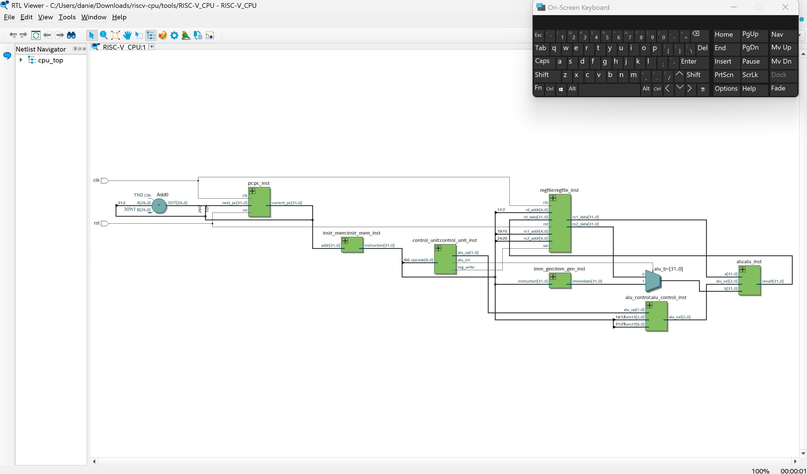
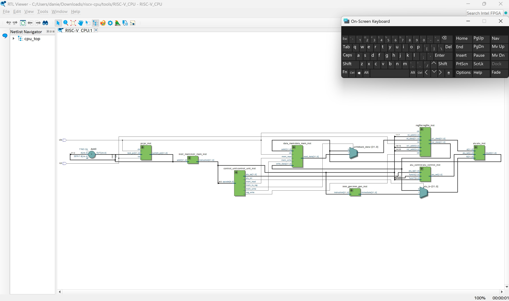
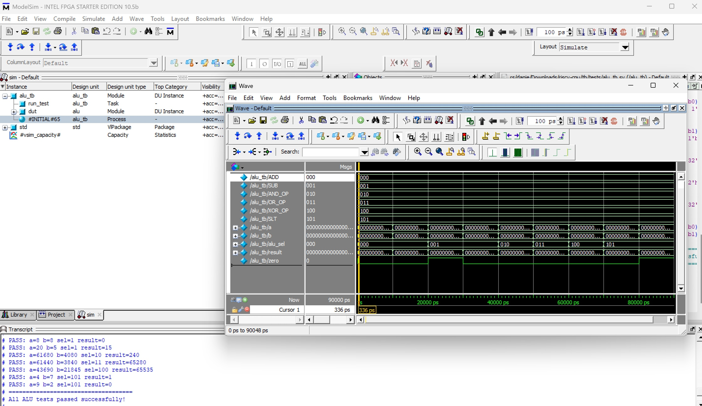
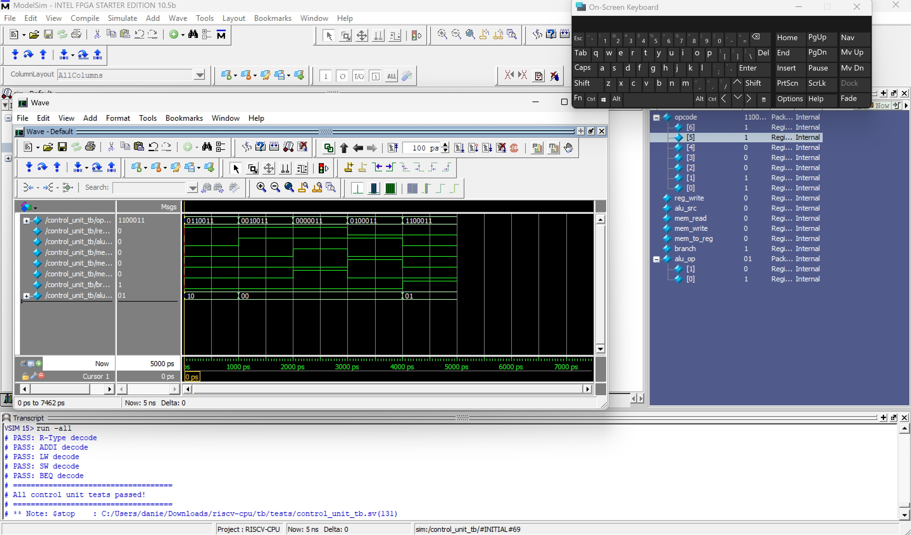
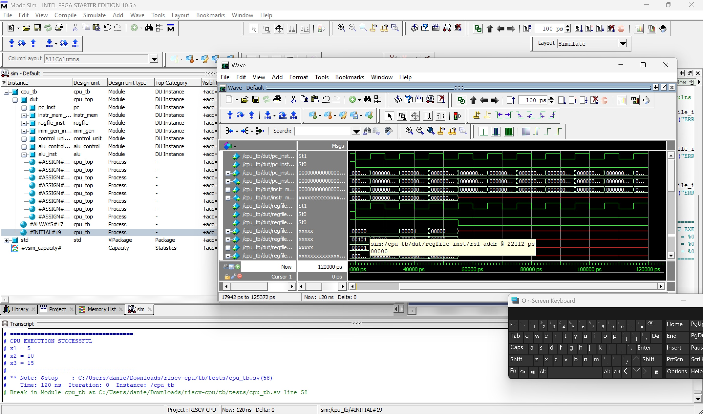
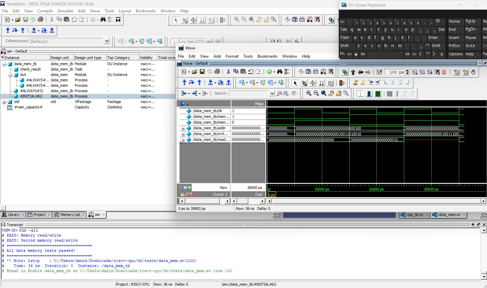
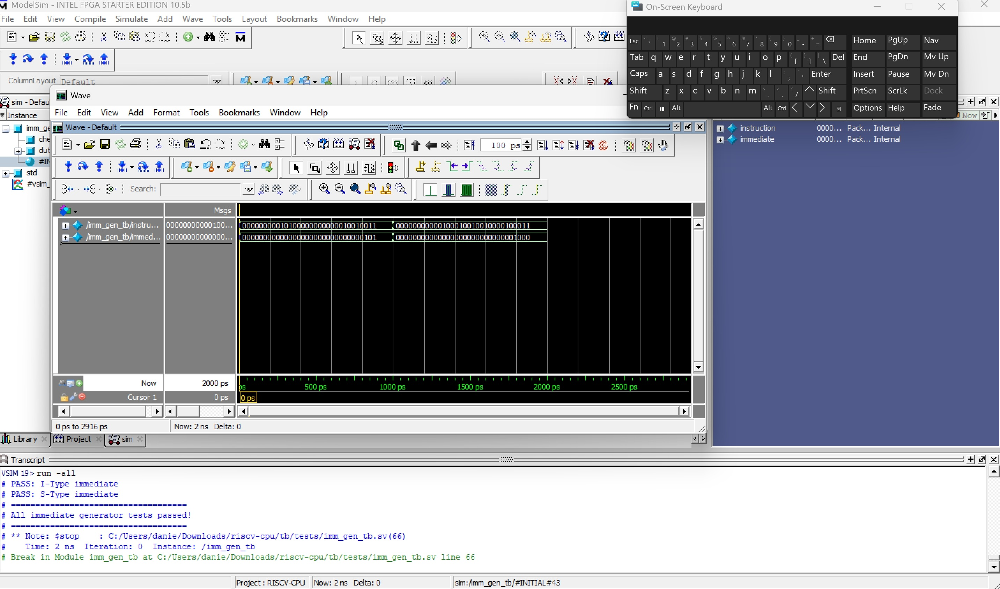
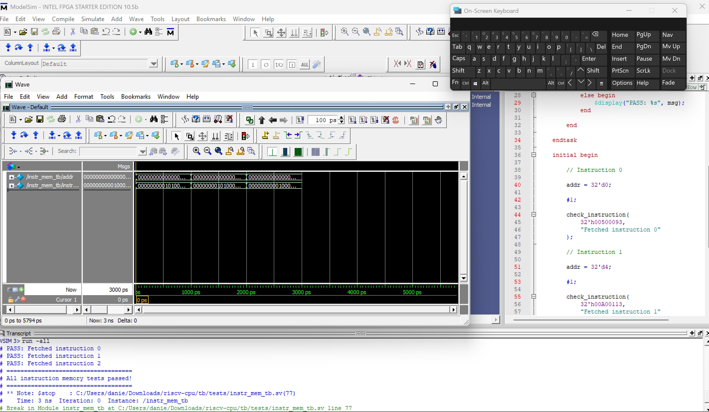
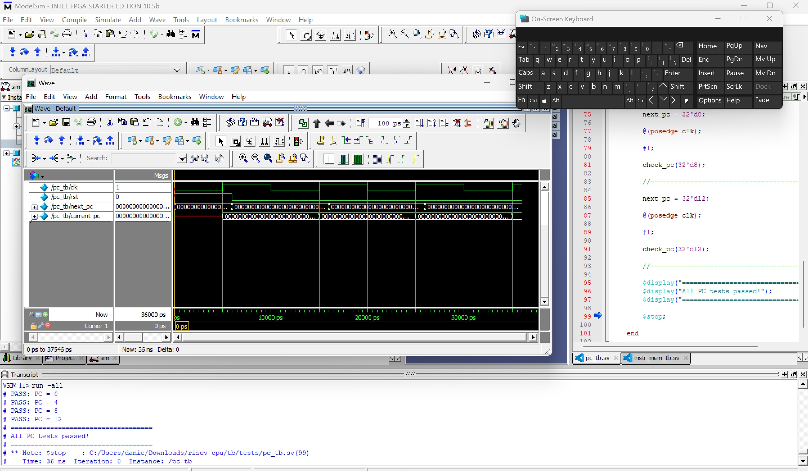
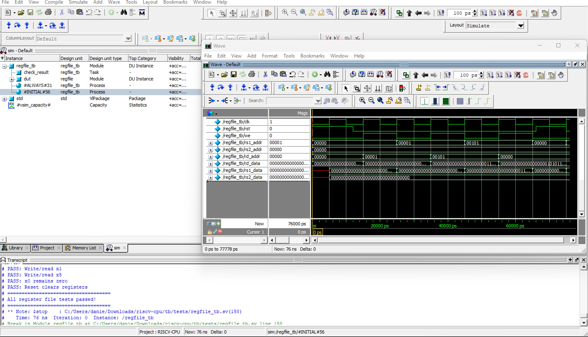

# RV32I Pipelined RISC-V CPU

32-bit pipelined RV32I RISC-V processor written in SystemVerilog featuring forwarding, hazard detection, and a verification environment using ModelSim.

---

## Status

In Active Development

---

## Planned Features

- 5-stage pipeline
- Forwarding unit
- Hazard detection
- Branch handling
- Assertions
- Randomized testing
- Functional coverage

---

## Tools

- Quartus Prime
- ModelSim
- SystemVerilog
- Git/GitHub

---

## Development Log

### Day 1
- Implemented ALU and self-checking testbench

### Day 2
- Implemented RV32I register file
- Added self-checking register file testbench
- Implemented synchronous writes and combinational reads
- Added x0 protection logic

### Day 3
- Implemented Program Counter (PC)
- Added self-checking PC testbench
- Implemented instruction memory module
- Added instruction fetch verification testbench
- Loaded initial RV32I test instructions into memory

### Day 4
- Implemented RV32I control unit
- Added instruction decode logic
- Implemented immediate generator
- Added self-checking verification testbenches

### Day 5
- Implemented ALU control unit
- Added top-level CPU module
- Connected instruction fetch, decode, and execute stages
- Integrated single-cycle CPU datapath and executed first RV32I program

### Day 6
- Implemented data memory module
- Added load/store support
- Added writeback muxing
- Integrated memory access into CPU datapath
- Successfully executed LW/SW memory operations
- Verified full single-cycle RV32I processor execution

### Day 7
- Began pipelined CPU architecture
- Implemented IF/ID pipeline register
- Added staged instruction transfer between IF and ID stages
- Added self-checking IF/ID pipeline register testbench

---

## Current Supported Instructions

### Arithmetic
- ADD
- SUB
- ADDI

### Logical
- AND
- OR
- XOR
- SLT

### Memory
- LW
- SW

### Branch
- BEQ

---

## Current CPU Features

- Single-cycle RV32I datapath
- Instruction fetch
- Instruction decode
- Register file read/write
- Immediate generation
- ALU execution
- Data memory access
- Register writeback
- Self-checking verification environment

---

## RTL Architecture

### Updated Single-Cycle CPU Datapath

---

## Verification Waveforms

### ALU Testbench

### Control Unit Testbench

### CPU Execution

### Data Memory Testbench

### Immediate Generator Testbench

### Instruction Memory Testbench

### Program Counter Testbench

### Register File Testbench

---
